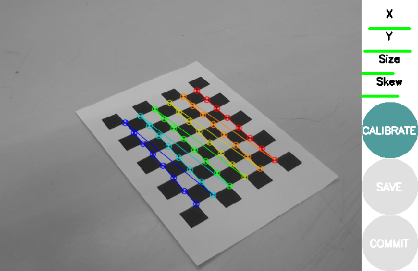
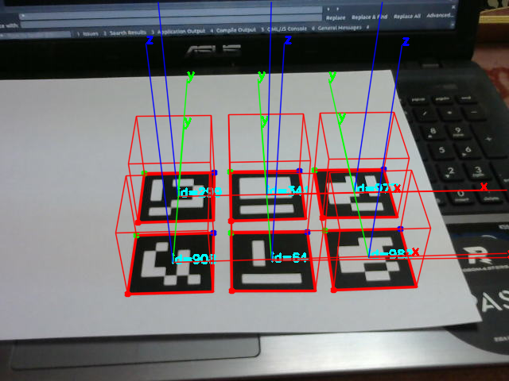
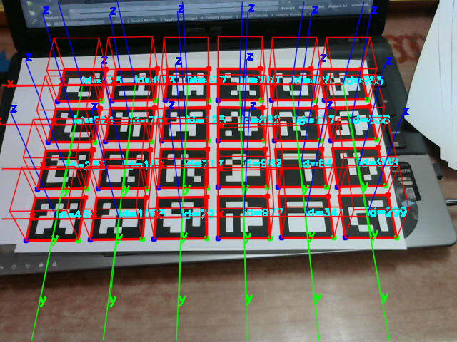

# OpenCV-Learning
some source codes of opencv

## Attention
When you use this source code, you should modify the path of the picture!

* The src/trackMarker.cpp, We show an intresting demo of [Aruco](http://www.uco.es/investiga/grupos/ava/node/26).
* Firstly, you should calibration your camera, in this demo, We use a camera of 
[Logitech C270](http://www.logitech.com/en-us/product/hd-webcam-c270). If you using [ROS](http://wiki.ros.org), Calibration is easy, here is a [Guide](http://wiki.ros.org/camera_calibration).
* This demo is test in Ubuntu 14.04, ROS indigo. OpenCV and Aruco is required, but ROS is not necessory.

### Here are some pictures of this demo
##### Calibration:

##### Result:

